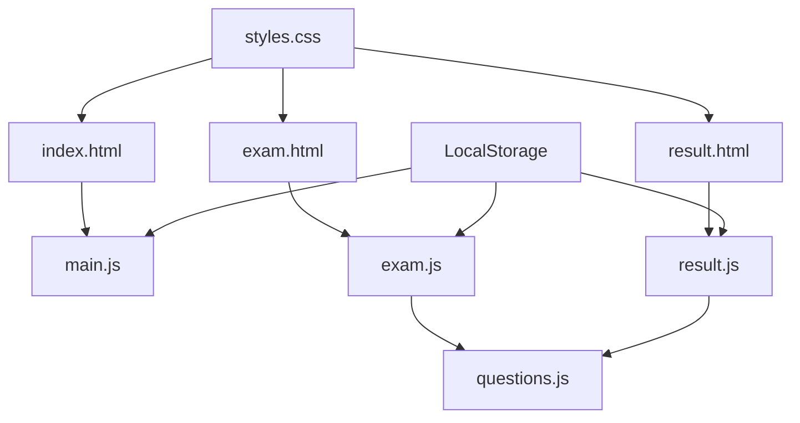

# 기술 명세서 (Technical Specifications)

## 📋 시스템 개요

### 프로젝트 정보
- **프로젝트명**: 웹프로그래밍 학습 지원 시스템
- **버전**: v2.0
- **아키텍처**: Client-Side SPA (Single Page Application)
- **개발 환경**: Modern Web Standards (HTML5, CSS3, ES6+)

---

## 🏗️ 시스템 아키텍처

### 클라이언트 아키텍처
```
┌─────────────────────────────────────────┐
│                Browser                  │
├─────────────────────────────────────────┤
│  Presentation Layer (UI Components)    │
│  ├─ index.html (Landing Page)          │
│  ├─ exam.html (Exam Interface)         │
│  └─ result.html (Results Page)         │
├─────────────────────────────────────────┤
│  Business Logic Layer (JavaScript)     │
│  ├─ main.js (User Management)          │
│  ├─ exam.js (Exam Logic)               │
│  ├─ questions.js (Data Model)          │
│  └─ result.js (Results Processing)     │
├─────────────────────────────────────────┤
│  Data Layer (LocalStorage)             │
│  ├─ userInfo (User Data)               │
│  ├─ examAnswers (Answer Data)          │
│  └─ examData (Session Data)            │
└─────────────────────────────────────────┘
```

### 모듈 구조도


---

## 💻 기술 스택

### 프론트엔드 기술
| 기술 | 버전 | 목적 | 비고 |
|------|------|------|------|
| HTML5 | - | 마크업 구조 | 시맨틱 태그 사용 |
| CSS3 | - | 스타일링 | Grid, Flexbox, Variables |
| JavaScript | ES6+ | 로직 구현 | 순수 바닐라 JS |
| Google Fonts | - | 웹폰트 | Pretendard, Inter |
| LocalStorage API | - | 데이터 저장 | 브라우저 내장 |

### 디자인 시스템
```css
/* Color System - Ocean Blue */
:root {
    --primary-color: #0ea5e9;      /* Main Blue */
    --secondary-color: #0284c7;    /* Dark Blue */
    --accent-color: #38bdf8;       /* Light Blue */
    --success-color: #10b981;      /* Green */
    --warning-color: #f59e0b;      /* Orange */
    --error-color: #ef4444;        /* Red */
    --gray-50: #f8fafc;           /* Light Gray */
    --gray-900: #0f172a;          /* Dark Gray */
}

/* Typography System */
font-family: 'Pretendard', 'Inter', system-ui, -apple-system, sans-serif;
font-size: 16px (base);
line-height: 1.5;
```

---

## 🔧 핵심 컴포넌트

### 1. 사용자 관리 시스템 (main.js)
```javascript
/**
 * 사용자 정보 관리 클래스
 */
class UserManager {
    constructor() {
        this.userInfo = this.loadUserInfo();
    }
    
    /**
     * 사용자 정보 저장
     * @param {Object} userInfo - 사용자 정보 객체
     * @param {string} userInfo.name - 사용자 이름
     * @param {string} userInfo.studentId - 학번
     */
    saveUserInfo(userInfo) {
        localStorage.setItem('userInfo', JSON.stringify(userInfo));
    }
    
    /**
     * 저장된 사용자 정보 로드
     * @returns {Object|null} 사용자 정보 또는 null
     */
    loadUserInfo() {
        const stored = localStorage.getItem('userInfo');
        return stored ? JSON.parse(stored) : null;
    }
}
```

### 2. 시험 관리 시스템 (exam.js)
```javascript
/**
 * 시험 진행 관리 클래스
 */
class ExamManager {
    constructor() {
        this.currentQuestion = 0;
        this.examAnswers = {};
        this.timeLeft = 3600; // 60분
        this.timer = null;
    }
    
    /**
     * 문제 표시 함수
     * @param {number} index - 문제 인덱스
     */
    displayQuestion(index) {
        const question = questions[index];
        // 문제 렌더링 로직
        this.updateNavigation();
        this.updateReferenceGuide();
        this.updateScoreTracker();
    }
    
    /**
     * 실시간 점수 추적
     */
    updateScoreTracker() {
        const answeredCount = Object.keys(this.examAnswers).length;
        const currentScore = answeredCount * 2;
        // UI 업데이트 로직
    }
    
    /**
     * 학습 가이드 업데이트
     */
    updateReferenceGuide() {
        const question = questions[this.currentQuestion];
        const guide = question.guide || this.generateBasicGuide(question);
        // 가이드 렌더링 로직
    }
}
```

### 3. 문제 데이터 모델 (questions.js)
```javascript
/**
 * 문제 객체 구조
 */
const QuestionSchema = {
    id: Number,           // 문제 고유 ID
    type: String,         // 'multiple' | 'short'
    question: String,     // 문제 텍스트
    options: Array,       // 선택지 (객관식만)
    answer: Number|String,// 정답
    explanation: String,  // 해설
    guide: {              // 학습 가이드 (선택)
        title: String,
        content: String
    }
};

/**
 * 문제 배열
 */
const questions = [
    // 50개 문제 데이터
];
```

### 4. 결과 처리 시스템 (result.js)
```javascript
/**
 * 결과 처리 클래스
 */
class ResultProcessor {
    /**
     * 시험 채점
     * @param {Object} answers - 답안 객체
     * @returns {Object} 채점 결과
     */
    gradeExam(answers) {
        let multipleCorrect = 0;
        let shortCorrect = 0;
        
        questions.forEach(question => {
            const userAnswer = answers[question.id];
            let isCorrect = false;
            
            if (question.type === 'multiple') {
                isCorrect = (userAnswer !== undefined);
            } else {
                isCorrect = (userAnswer && userAnswer.trim() !== '');
            }
            
            if (isCorrect) {
                question.type === 'multiple' ? multipleCorrect++ : shortCorrect++;
            }
        });
        
        return {
            totalScore: (multipleCorrect + shortCorrect) * 2,
            multipleCorrect,
            shortCorrect
        };
    }
}
```

---

## 🎨 UI 컴포넌트 시스템

### 레이아웃 그리드 시스템
```css
/* 3열 그리드 레이아웃 */
.exam-content {
    display: grid;
    grid-template-columns: 250px 1fr 400px; /* 네비 + 문제 + 가이드 */
    gap: 2rem;
    max-width: 1500px;
    margin: 0 auto;
}

/* 반응형 브레이크포인트 */
@media (max-width: 1199px) {
    .exam-content {
        grid-template-columns: 200px 1fr; /* 2열로 축소 */
    }
    .reference-guide { display: none; }
}

@media (max-width: 767px) {
    .exam-content {
        grid-template-columns: 1fr; /* 1열로 축소 */
    }
}
```

### 컴포넌트 스타일 가이드
```css
/* 기본 카드 컴포넌트 */
.card {
    background: white;
    border-radius: 12px;
    padding: 2rem;
    box-shadow: 0 4px 6px rgba(0, 0, 0, 0.1);
    border: 1px solid rgba(14, 165, 233, 0.1);
    transition: all 0.15s ease-out;
}

.card:hover {
    transform: scale(1.02);
    box-shadow: 0 10px 15px rgba(0, 0, 0, 0.1);
}

/* 버튼 컴포넌트 */
.btn {
    padding: 0.75rem 1.5rem;
    border: none;
    border-radius: 8px;
    font-weight: 500;
    cursor: pointer;
    transition: all 0.15s ease-out;
}

.btn-primary {
    background: linear-gradient(135deg, var(--primary-color), var(--accent-color));
    color: white;
}

.btn-primary:hover {
    transform: scale(1.02);
    box-shadow: 0 4px 12px rgba(14, 165, 233, 0.4);
}
```

---

## 📊 데이터 구조

### LocalStorage 스키마
```javascript
// 사용자 정보
{
    "userInfo": {
        "name": "string",
        "studentId": "string",
        "startTime": "ISO Date String"
    }
}

// 답안 데이터
{
    "examAnswers": {
        "1": 0,              // 객관식: 선택지 인덱스
        "2": 1,
        "41": "답안 텍스트",  // 단답식: 텍스트
        "42": "답안 텍스트"
    }
}

// 시험 세션 데이터
{
    "examData": {
        "userInfo": {},
        "answers": {},
        "startTime": "ISO Date String",
        "endTime": "ISO Date String",
        "timeSpent": 1234,    // 초 단위
        "isTimeout": false
    }
}
```

### 문제 데이터 구조
```javascript
// questions.js 내 데이터 구조
const questions = [
    {
        id: 1,
        type: 'multiple',
        question: '문제 텍스트',
        options: ['선택지1', '선택지2', '선택지3', '선택지4'],
        answer: 0,  // 정답 인덱스
        explanation: '해설 텍스트',
        guide: {
            title: '학습 가이드 제목',
            content: 'HTML 형태의 학습 내용'
        }
    },
    {
        id: 41,
        type: 'short',
        question: '단답형 문제 텍스트',
        answer: '정답 텍스트',
        keywords: ['키워드1', '키워드2'],  // 채점용 키워드
        explanation: '해설 텍스트'
    }
];
```

---

## 🔄 상태 관리

### 애플리케이션 상태
```javascript
// 전역 상태 변수
let currentQuestion = 0;          // 현재 문제 번호
let examAnswers = {};             // 답안 객체
let timeLeft = 3600;              // 남은 시간 (초)
let examTimer = null;             // 타이머 객체

// 상태 업데이트 함수들
function updateNavigation() { /* 네비게이션 상태 업데이트 */ }
function updateScoreTracker() { /* 점수 추적기 업데이트 */ }
function updateReferenceGuide() { /* 학습 가이드 업데이트 */ }
```

### 이벤트 흐름
```
사용자 액션 → 상태 변경 → UI 업데이트 → LocalStorage 저장
     ↑                                           ↓
     └─────────────── 페이지 로드 시 복원 ←──────────┘
```

---

## 🚀 성능 최적화

### JavaScript 최적화
```javascript
// DOM 쿼리 최적화 - 캐싱 사용
const scoreDisplay = document.getElementById('currentScore');
const scoreBar = document.getElementById('scoreBar');

// 이벤트 위임 패턴
document.getElementById('optionsContainer').addEventListener('click', (e) => {
    if (e.target.matches('.option')) {
        handleOptionClick(e.target);
    }
});

// 디바운싱을 통한 입력 최적화
function debounce(func, wait) {
    let timeout;
    return function executedFunction(...args) {
        const later = () => {
            clearTimeout(timeout);
            func(...args);
        };
        clearTimeout(timeout);
        timeout = setTimeout(later, wait);
    };
}
```

### CSS 최적화
```css
/* GPU 가속 활용 */
.card {
    transform: translateZ(0); /* GPU 레이어 생성 */
    will-change: transform;   /* 변형 예고 */
}

/* 효율적인 애니메이션 */
@keyframes fadeIn {
    from { opacity: 0; transform: translateY(20px); }
    to { opacity: 1; transform: translateY(0); }
}

/* Critical CSS 인라인 */
/* 중요한 스타일은 HTML 내 <style> 태그에 인라인 */
```

---

## 🔒 보안 고려사항

### XSS 방지
```javascript
// HTML 이스케이프 함수
function escapeHtml(text) {
    const map = {
        '&': '&amp;',
        '<': '&lt;',
        '>': '&gt;',
        '"': '&quot;',
        "'": '&#039;'
    };
    return text.replace(/[&<>"']/g, m => map[m]);
}

// 사용자 입력 처리 시 적용
const safeText = escapeHtml(userInput);
```

### 데이터 검증
```javascript
// 입력 데이터 검증
function validateUserInfo(userInfo) {
    if (!userInfo.name || userInfo.name.trim().length === 0) {
        throw new Error('이름은 필수입니다.');
    }
    if (!userInfo.studentId || userInfo.studentId.trim().length === 0) {
        throw new Error('학번은 필수입니다.');
    }
    return true;
}
```

---

## 🧪 테스트 전략

### 수동 테스트 체크리스트
```
□ 사용자 정보 입력 및 저장
□ 시험 시작 및 타이머 작동
□ 문제 네비게이션 (이전/다음/번호 클릭)
□ 객관식 답안 선택 및 저장
□ 단답식 답안 입력 및 저장
□ 자동 저장 기능 (10초 간격)
□ 실시간 점수 업데이트
□ 학습 가이드 표시 및 토글
□ 시간 초과 시 자동 제출
□ 수동 제출 및 결과 표시
□ 브라우저 새로고침 시 데이터 복원
□ 반응형 디자인 (모바일/태블릿/데스크톱)
```

### 브라우저 호환성
```
✅ Chrome 90+
✅ Firefox 88+
✅ Safari 14+
✅ Edge 90+
❌ Internet Explorer (지원 중단)
```

---

## 📱 반응형 디자인

### 브레이크포인트 전략
```css
/* Mobile First Approach */
/* Base: 320px+ (모바일) */
.container { padding: 1rem; }

/* Small: 576px+ (큰 모바일) */
@media (min-width: 576px) {
    .container { padding: 1.5rem; }
}

/* Medium: 768px+ (태블릿) */
@media (min-width: 768px) {
    .exam-content { grid-template-columns: 200px 1fr; }
}

/* Large: 992px+ (작은 데스크톱) */
@media (min-width: 992px) {
    .exam-content { grid-template-columns: 250px 1fr 350px; }
}

/* Extra Large: 1200px+ (큰 데스크톱) */
@media (min-width: 1200px) {
    .exam-content { grid-template-columns: 280px 1fr 420px; }
}
```

### 디바이스별 최적화
| 디바이스 | 해상도 | 레이아웃 | 특징 |
|----------|--------|----------|------|
| 스마트폰 | ~575px | 1열 | 가이드 숨김, 터치 최적화 |
| 태블릿 | 576-991px | 2열 | 가이드 숨김, 네비게이션 축소 |
| 노트북 | 992-1199px | 3열 | 가이드 표시, 균형 레이아웃 |
| 데스크톱 | 1200px+ | 3열 확장 | 가이드 확대, 여유로운 공간 |

---

## 🔧 빌드 및 배포

### 개발 환경 설정
```bash
# 프로젝트 클론
git clone https://github.com/aebonlee/web_final.git
cd web_final

# 로컬 서버 실행 (선택사항)
python -m http.server 8000
# 또는
npx serve .

# 브라우저에서 접속
open http://localhost:8000
```

### 배포 요구사항
- 정적 파일 호스팅 서비스 (GitHub Pages, Netlify, Vercel 등)
- HTTPS 지원 (보안 강화)
- CDN 적용 (성능 향상)
- 압축 및 최적화 (gzip, minification)

---

## 📋 API 문서

### LocalStorage API 사용
```javascript
// 데이터 저장
localStorage.setItem(key, value);

// 데이터 로드
const data = localStorage.getItem(key);

// 데이터 삭제
localStorage.removeItem(key);

// 전체 데이터 삭제
localStorage.clear();
```

### 사용자 정의 API
```javascript
// 사용자 관리 API
UserManager.saveUserInfo(userInfo);
UserManager.loadUserInfo();

// 시험 관리 API
ExamManager.displayQuestion(index);
ExamManager.updateScoreTracker();
ExamManager.updateReferenceGuide();

// 결과 처리 API
ResultProcessor.gradeExam(answers);
ResultProcessor.displayResults(results);
```

---

## 🚀 향후 확장 계획

### Phase 2: 서버 연동
```
Frontend (현재) + Backend (Node.js + Express) + Database (MongoDB)
```

### Phase 3: 고급 기능
- 실시간 협업 학습
- AI 기반 개인화 추천
- 학습 분석 대시보드
- 모바일 네이티브 앱

---

**📅 문서 작성일**: 2025년 11월 23일  
**📝 문서 버전**: v1.0  
**👨‍💻 작성자**: Claude Code AI Assistant  
**🔄 최종 수정**: 프로젝트 완료 시점

> 💡 이 기술 명세서는 시스템의 모든 기술적 측면을 포괄적으로 다루며, 개발자가 코드를 이해하고 확장하는 데 필요한 모든 정보를 제공합니다.